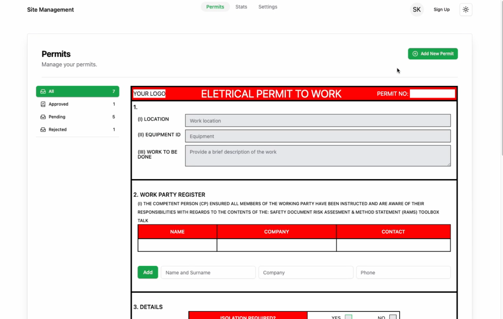
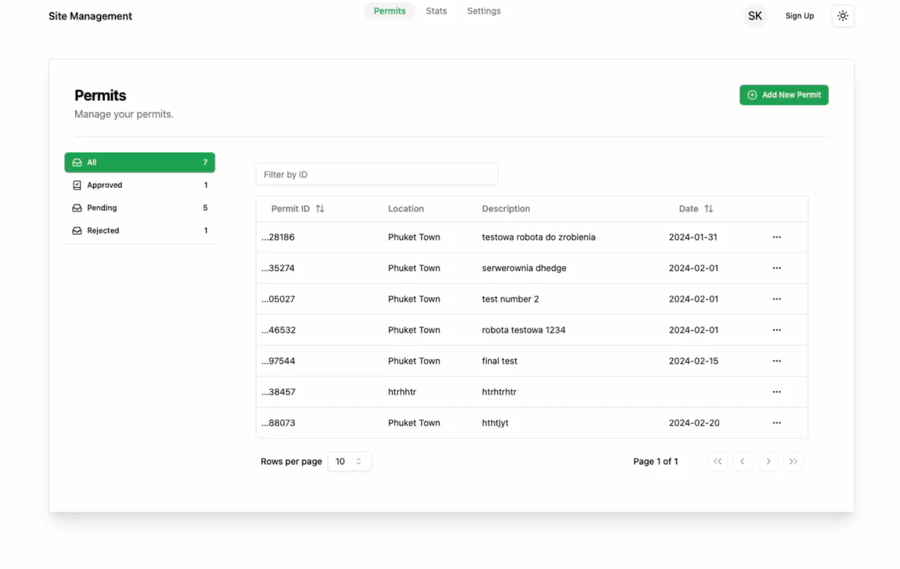
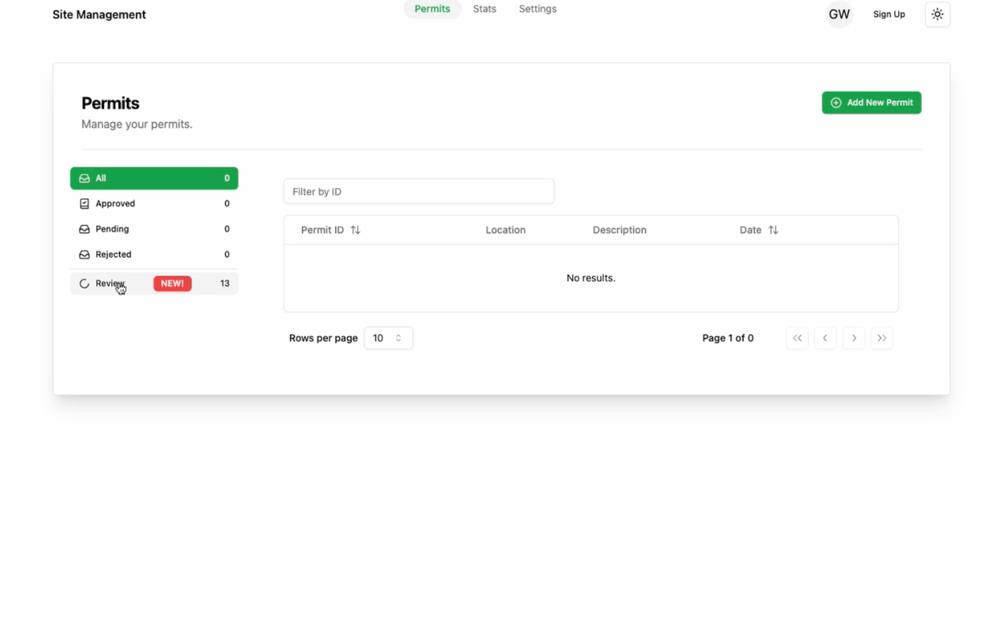

<h1>Site Management (demo)</h1>

Site Management is a comprehensive web application designed to streamline permit management for construction sites. With Site Management, administrators can effortlessly create and manage projects, add personnel, and assign specific roles to users. Our platform aims to digitize and simplify the paperwork involved in construction projects, facilitating efficient collaboration and organization on-site.

 

   &nbsp;&nbsp;&nbsp;&nbsp;&nbsp;

   &nbsp;&nbsp;&nbsp;&nbsp;&nbsp;

  Technologies used: NextJS, tailwindCss, JavaScript, Firebase

